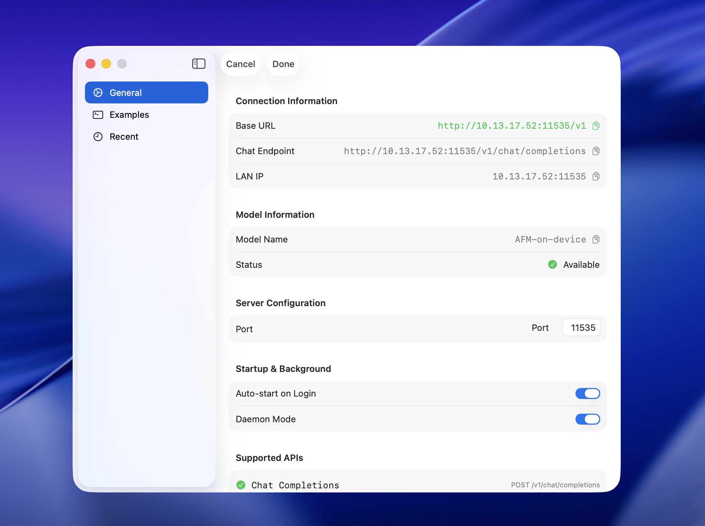

# afmd — Apple Foundation Model Daemon Service

A lightweight macOS menu bar service that exposes an OpenAI-compatible API using Apple's on-device Foundation Models. It runs headlessly (no Dock icon), controlled from the menu bar. Supports text generation, vision analysis (OCR, object detection), and multimodal chat capabilities.


## Usage

1. Launch the app; look for the brain icon in the menu bar.
2. Start/Stop the local server from the menu.
3. Use the menu to copy:
   - Base URL (e.g. `http://127.0.0.1:11535/v1`)
   - Chat Completions endpoint (e.g. `/v1/chat/completions`)
   - Model name (`AFM-on-device`)

### Quick Start (Python)

```python
from openai import OpenAI

client = OpenAI(
    base_url="http://127.0.0.1:11535/v1",
    api_key="not-needed"
)

resp = client.chat.completions.create(
    model="AFM-on-device",
    messages=[{"role": "user", "content": "Hello!"}],
)
print(resp.choices[0].message.content)
```

📖 **For detailed examples including multimodal chat, vision APIs, and more → [Usage Guide](usage.md)**

### Endpoints

- `GET /health` — Health check
- `GET /status` — Model status
- `GET /v1/models` — List models
- `POST /v1/chat/completions` — Chat completions (SSE supported with `stream=true`)
- `POST /v1/chat/completions/multimodal` — Multimodal chat (text + images)
- `POST /v1/vision/ocr` — Extract text from images
- `POST /v1/vision/detect` — Detect objects in images
- `POST /v1/vision/analyze` — Comprehensive image analysis

### Example cURL

```bash
curl -X POST "http://127.0.0.1:11535/v1/chat/completions" \
  -H "Content-Type: application/json" \
  -d '{
    "model": "AFM-on-device",
    "messages": [{"role": "user", "content": "Hello!"}]
  }'
```

### Acknowledgments

- [Apple Foundation Models](https://developer.apple.com/documentation/foundationmodels) Apple's on-device Foundation Models 
- [apple-on-device-openai](https://github.com/gety-ai/apple-on-device-openai) a local API server for macOS 26.0 or later 
- [maclocal-api](https://github.com/scouzi1966/maclocal-api) another local API server for macOS 26.0 or later 
- [enableAppleAI](https://github.com/kanshurichard/enableAppleAI) Enable Apple Intelligence on your device 